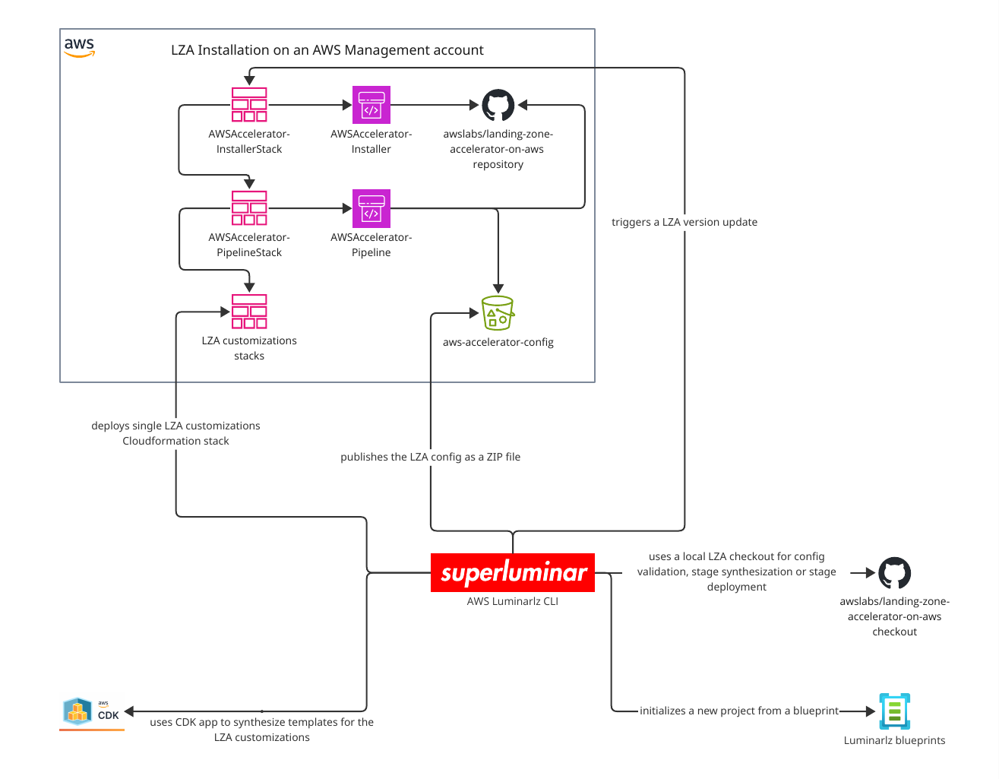

# AWS luminarlz CLI


A lean, opinionated CLI
to make deployment and development with the [Landing Zone Accelerator on AWS (LZA)](https://docs.aws.amazon.com/solutions/latest/landing-zone-accelerator-on-aws) easier.

## What it does and doesn't and what you need to know

 - It provides a blueprint to easily set up a [well-architected AWS landing zone](https://docs.aws.amazon.com/prescriptive-guidance/latest/migration-aws-environment/welcome.html).
 - It helps you with the deployment and maintenance of the [LZA](https://docs.aws.amazon.com/solutions/latest/landing-zone-accelerator-on-aws).
 - It does not add any new features to the LZA.
 - In case you want, it lets you [opt out](#remove-the-aws-luminarlz-cli) and remove the dependency to the AWS luminarlz CLI completely.
 - It uses [LiquidJS](https://liquidjs.com/) to generate the LZA config files.
 - It uses [AWS CDK](https://github.com/aws/aws-cdk) to generate the [AWS Cloudformation](https://docs.aws.amazon.com/cloudformation/) templates used for the [LZA customizations](https://awslabs.github.io/landing-zone-accelerator-on-aws/latest/faq/customizations/).
 - It doesn't replace but consumes the [LZA Core CLI](https://awslabs.github.io/landing-zone-accelerator-on-aws/latest/developer-guide/scripts/#core-cli) by automatically cloning [a local LZA checkout](https://github.com/awslabs/landing-zone-accelerator-on-aws) with the correct LZA version.
 - It allows you to easily use [LZA Core CLI](https://awslabs.github.io/landing-zone-accelerator-on-aws/latest/developer-guide/scripts/#core-cli) features like [LZA config validation](https://awslabs.github.io/landing-zone-accelerator-on-aws/latest/developer-guide/scripts/#configuration-validator), [LZA Core Pipeline stage synthesis or LZA Core Pipeline stage deployment](https://awslabs.github.io/landing-zone-accelerator-on-aws/latest/developer-guide/scripts/#core-cli).
 - It's not a free lunch and still requires you to know how various AWS libraries and services work together. Here are some readings to dive into:
   - [The LZA architecture overview](https://docs.aws.amazon.com/solutions/latest/landing-zone-accelerator-on-aws/architecture-overview.html).
   - [LZA is recommended to be used together with AWS Control Tower](https://awslabs.github.io/landing-zone-accelerator-on-aws/latest/faq/ct-cfct/).
   - [LZA supports deploying custom Cloudformation Stacks, StackSets and more](https://awslabs.github.io/landing-zone-accelerator-on-aws/latest/faq/customizations/).
   - An LZA installation comes with the [Installer Pipeline](https://docs.aws.amazon.com/solutions/latest/landing-zone-accelerator-on-aws/awsaccelerator-installer.html) & the [Core Pipeline](https://docs.aws.amazon.com/solutions/latest/landing-zone-accelerator-on-aws/awsaccelerator-pipeline.html).

### Architecture diagram



## Usage

### Initialize a new AWS landing zone

This is a step-by-step guide to initialize a new AWS landing zone using the luminarlz CLI.

We'll use the [foundational blueprint](blueprints/foundational/) that is heavily aligned with the [Guidance for Establishing an Initial Foundation using Control Tower on AWS](https://aws.amazon.com/solutions/guidance/establishing-an-initial-foundation-using-control-tower-on-aws).

We recommend reading through the [Guidance](https://aws.amazon.com/solutions/guidance/establishing-an-initial-foundation-using-control-tower-on-aws) first
as there are parts that require some manual steps and upfront planning like the root email strategy.

1. Make sure you have an AWS Organizations management account which fulfils [the LZA prerequisites](https://docs.aws.amazon.com/solutions/latest/landing-zone-accelerator-on-aws/prerequisites.html).
2. Make sure to [deploy the LZA](https://docs.aws.amazon.com/solutions/latest/landing-zone-accelerator-on-aws/deploy-the-solution.html) with the following settings:
   - **Environment Configuration**: Leave all the defaults, `Control Tower Environment` needs to be set to `Yes`.
   - **Config Repository Configuration**: Leave all the defaults and set `Configuration Repository Location` to `s3`.
3. Wait until the initial LZA is [successfully deployed](https://docs.aws.amazon.com/solutions/latest/landing-zone-accelerator-on-aws/step-2.-await-initial-environment-deployment.html).
4. Configure your terminal with AWS administrator credentials for the `Management` AWS account.
5. Init the project using:
```bash
npx @superluminar-io/aws-luminarlz-cli init
```
6. Install the new dependencies:
```bash
npm install
```
7. Adapt the settings and fill in the open `TODOS` in the generated `config.ts` file.
8. Have a look at the generated [README](blueprints/foundational/README.md) file
   as it contains further documentation on how to use the AWS luminarlz CLI.
9. Deploy your new LZA config using:
```bash
# You'll need the `Management` account credentials with administrator rights to be configured in your terminal.
npm run cli -- deploy
```
10. Search for open `TODO` comments in the generated files and adapt them to your needs.

### Other CLI commands

Documentation for the other CLI commands can be found in the README generated when intializing a new AWS landing zone.
Have a look at the [foundational blueprint README](blueprints/foundational/README.md).

This includes `setup update`, which updates existing project files from the selected blueprint with interactive diffs.
For a practical step-by-step workflow, see the [Setup Update Runbook](docs/runbooks/setup-update.md).
For local CLI feature development against a real setup repository, see the [Local CLI Development Runbook](docs/runbooks/local-cli-development-with-real-setup.md).

#### LZA Core CLI

Some of the CLI commands are using the [LZA Core CLI](https://awslabs.github.io/landing-zone-accelerator-on-aws/latest/developer-guide/scripts/#core-cli) underneath.

Running the LZA core CLI currently requires a local checkout of the LZA repository and building the project which will take a moment.

This will be done automatically for you once and every time you update the LZA version.

You should add `/.landing-zone-accelerator-on-aws-*` to your `.gitignore` file so that these local LZA checkouts are not committed to your repository.

## Development

### Prerequisites

- Install the node version defined in [.node-version](.node-version).
- Install dependencies:
```bash
yarn projen
```
- To run the CLI without building it:
```bash
./src/index.ts
```

## Remove the AWS luminarlz CLI

For whatever reason you want to remove the dependency to the AWS luminarlz CLI you can do so.
After calling:
```bash
npm run cli -- synth
```
You find the raw aws-accelerator-config in the `aws-accelerator-config.out` directory
and [deploy it](https://docs.aws.amazon.com/solutions/latest/landing-zone-accelerator-on-aws/step-3.-update-the-configuration-files.html#using-s3)
with any other mechanism you like.
