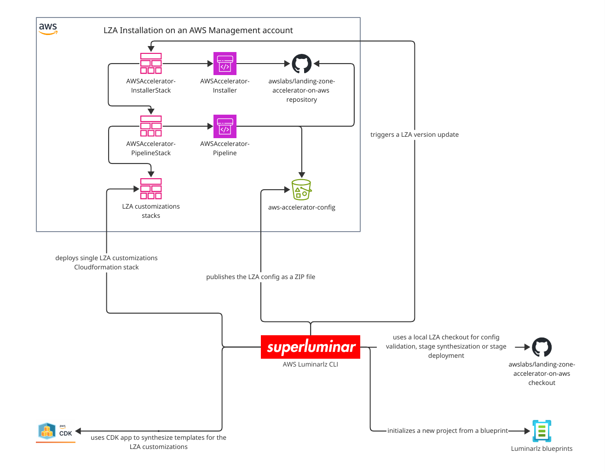
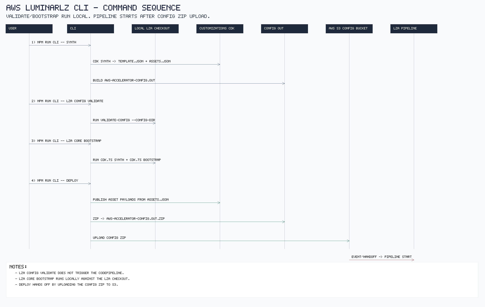

# AWS Luminarlz CLI Command Playbook

This runbook gives a practical overview of the CLI commands, what exactly they do, and the recommended execution order for common workflows.

Quick navigation:
- [Core Concepts](#core-concepts)
- [Command Sequence Diagram](#command-sequence-diagram)
- [LZA Context (Why This Flow Exists)](#lza-context-why-this-flow-exists)
- [LZA Stage Overview](#lza-stage-overview)
- [Stages vs. Config YAML Inputs](#stages-vs-config-yaml-inputs)
- [Config YAML Purpose Reference](#config-yaml-purpose-reference)
- [Artifact Lifecycle (customizationsCdkSynth)](#artifact-lifecycle-customizationscdksynth)
- [Command Deep Dive](#command-deep-dive)
- [Deployment Paths](#deployment-paths)
- [Quick Decision Matrix](#quick-decision-matrix)

## Architecture Context

The CLI is a wrapper around LZA workflows.
Some commands are local-only, while `lza ...` commands call into a local checkout of `landing-zone-accelerator-on-aws`.

## Command Sequence Diagram

## Core Concepts

- `aws-accelerator-config.out/` is the local synthesized config directory used for validation and as source for ZIP publishing.
- `aws-accelerator-config.out.zip` is the transport artifact uploaded to the LZA config bucket.
- `.landing-zone-accelerator-on-aws-release-v<version>/` is the local LZA checkout used by `lza ...` wrapper commands.
- LZA config repository model (upstream): https://docs.aws.amazon.com/solutions/latest/landing-zone-accelerator-on-aws/using-configuration-files.html

Version source for `<version>`:
- Initial project setup: derived from the installed Accelerator version (SSM parameter `/accelerator/AWSAccelerator-InstallerStack/version`) during `init`.
- Ongoing control in this repository: `config.ts` (`config.awsAcceleratorVersion`) defines which `release/v<version>` branch is used for local checkout and LZA wrapper execution.

## Customizations CDK Artifacts

This is the CDK-specific part of the flow, not an independent LZA core concept.

- `customizations/cdk.out/` contains CDK synth output for customizations.
- `*.template.json` files describe CloudFormation stacks.
- `*.assets.json` files are CDK asset manifests; they describe which asset payloads must be published for those stacks.
- [`customizationsPublishCdkAssets`](#where-customizations-asset-payload-publish-runs) reads those manifests and publishes the referenced payloads before stack deployment.

Terminology used in this document:
- asset manifest: the `*.assets.json` file.
- asset payload: the real uploaded file/image content referenced by a manifest.

## Two Different cdk.out Directories

Use this distinction strictly to avoid debugging the wrong artifacts:

1. Project customizations output:
- `customizations/cdk.out`
- Produced by `customizationsCdkSynth`.
- Used by `synth` and `deploy` flows in this project.

2. LZA checkout output:
- `.landing-zone-accelerator-on-aws-release-v<version>/source/packages/@aws-accelerator/accelerator/cdk.out`
- Produced by upstream LZA synth commands.
- Used by `lza ...` wrapper command flows.

Rule:
- When troubleshooting `deploy` artifact publishing, start with `customizations/cdk.out`.
- When troubleshooting `lza stage ...` or `lza customizations-stack ...`, inspect the LZA checkout `cdk.out` (see [Deployment Paths](#deployment-paths)).

## Artifact Lifecycle (customizationsCdkSynth)

`customizationsCdkSynth` creates both artifact types in `customizations/cdk.out/`:

1. `*.template.json`
- What: CloudFormation templates for customizations stacks.
- Where they go next: copied into `aws-accelerator-config.out/customizations/cdk.out/` during `synthConfigOut`.
- Who uses them: LZA customizations deployment logic (stage/customizations-stack deploy paths, see [Deployment Paths](#deployment-paths)).
- Stage relevance: `customizations` stage.

2. `*.assets.json`
- What: CDK asset manifests for payloads referenced by templates.
- Where they go next: not copied into `aws-accelerator-config.out`; consumed directly from `customizations/cdk.out` by [`customizationsPublishCdkAssets`](#where-customizations-asset-payload-publish-runs).
- Who uses them: [`customizationsPublishCdkAssets`](#where-customizations-asset-payload-publish-runs) in CLI deploy flows; published payloads are then consumed during stack deployment.
- Stage relevance: required for `customizations` deployments when templates reference asset payloads.
- Target infrastructure ownership: publish targets are bootstrap resources (asset S3 bucket and, if used, asset ECR repository) provided by LZA/CDK bootstrap, not by customizations stack definitions in this repository.

Important distinction:
- `lza core bootstrap` prepares deploy infrastructure (for example asset bucket/roles; see [`lza core bootstrap`](#npm-run-cli----lza-core-bootstrap)).
- [`customizationsPublishCdkAssets`](#where-customizations-asset-payload-publish-runs) publishes customizations asset payloads into that prepared infrastructure (see [`deploy`](#npm-run-cli----deploy)).
- Actual customizations stack deployment consumes templates + published asset payloads afterward (see [Deployment Paths](#deployment-paths)).

## Artifact Hygiene (Commit vs Ephemeral)

Treat these as ephemeral build/check artifacts and do not commit them:

- `.landing-zone-accelerator-on-aws-*`
- `customizations/cdk.out`
- `aws-accelerator-config.out`
- `aws-accelerator-config.out.zip`

Keep only source-of-truth files in git (templates, config, customizations source, docs).

## Where customizations asset payload publish runs

`customizationsPublishCdkAssets` is executed in these command paths:

- Input: `customizations/cdk.out/*.assets.json` (asset manifests).
- Output: published asset payloads in bootstrap targets.

1. `npm run cli -- deploy`
2. `npm run cli -- lza stage deploy --stage customizations`
3. `npm run cli -- lza customizations-stack deploy --stack-name ... --account-id ...`

Not executed in:

- `npm run cli -- synth`
- `npm run cli -- lza config validate`
- `npm run cli -- lza core bootstrap`
- `npm run cli -- lza stage synth`
- `npm run cli -- lza customizations-stack synth`

## LZA Context (Why This Flow Exists)

The command behavior makes sense only in the LZA lifecycle context:

1. `AWSAccelerator-InstallerStack` creates/updates the installer pipeline.
2. Installer pipeline deploys/updates `AWSAccelerator-Pipeline` (core pipeline).
3. Core pipeline reads the published [config ZIP](#core-concepts) from the config bucket and executes [LZA stages](#lza-stage-overview) in order (including bootstrap and customizations when relevant).
4. The project effectively acts as a config and customization producer for that pipeline.

Why commands are split:

- `synth` exists to build deterministic local artifacts before any publish/deploy step.
- `lza config validate` exists to run upstream LZA validation logic against the exact synthesized config.
- `lza core bootstrap` exists because deploying asset payloads/stages to new account/region targets requires bootstrap resources first.
- `deploy` exists to publish the artifacts consumed by the core pipeline: customizations CDK payloads referenced by `customizations/cdk.out/*.assets.json` and the config ZIP (`aws-accelerator-config.out.zip`).

Upstream lifecycle references:
- Core pipeline overview: https://docs.aws.amazon.com/solutions/latest/landing-zone-accelerator-on-aws/awsaccelerator-pipeline.html
- Initial deployment flow: https://docs.aws.amazon.com/solutions/latest/landing-zone-accelerator-on-aws/step-2.-await-initial-environment-deployment.html

## LZA Stage Overview

The following is the core pipeline stage model used by LZA (high-level operator view):

1. `Source` - load LZA source + config source.
2. `Build` - transpile/validate configuration inputs.
3. `Prepare` - create/validate required accounts and org prerequisites.
4. `Accounts` - org account checks and SCP handling.
5. `Bootstrap` - run CDK bootstrap in target account/region environments.
6. `Review` (optional) - diff + manual approval gate.
7. `Logging` - deploy centralized logging/key dependencies.
8. `Organization` - deploy org-wide governance resources.
9. `Security_Audit` - deploy centralized security dependencies in audit account.
10. `Deploy` - execute deploy actions (`Network_Prepare`, `Security`, `Operations`, `Network_VPCs`, `Security_Resources`, `Network_Associations`, `Customizations` (optional), `Finalize`).

Important:
- Exact stage/action naming can vary by LZA version.
- In this CLI, the checkout/version is controlled by `config.ts` (`awsAcceleratorVersion`; see [Core Concepts](#core-concepts) and [`init`](#npm-run-cli----init)), so always interpret stage behavior in the context of that configured version.

Sources:
- AWS LZA Core pipeline docs: https://docs.aws.amazon.com/solutions/latest/landing-zone-accelerator-on-aws/awsaccelerator-pipeline.html
- Stage-name code reference used by `lza stage --stage ...`: https://github.com/awslabs/landing-zone-accelerator-on-aws/blob/main/source/packages/%40aws-accelerator/accelerator/lib/accelerator-stage.ts

### Stages vs. Config YAML Inputs

This mapping is not 1:1. Stages are execution steps, while YAML files are input models reused across multiple stages.

- `Build`: validates the full synthesized config set in `aws-accelerator-config.out` (all generated YAMLs).
- `Prepare` / `Accounts`: mostly driven by account and org structure inputs (`accounts-config.yaml`, `organization-config.yaml`), with inherited defaults from `global-config.yaml`.
- `Bootstrap`: bootstraps target account/region environments derived from the synthesized config set; there is no dedicated `bootstrap` YAML file.
- `Logging` / `Organization` / `Security_Audit` / `Deploy`: action-specific combinations of multiple config domains; most commonly `global-config.yaml`, `network-config.yaml`, `security-config.yaml`, `iam-config.yaml`, `organization-config.yaml`, and `accounts-config.yaml`.
- `Deploy -> Customizations` (optional action): primarily `customizations-config.yaml`, plus any referenced customizations artifacts/templates (see [Deployment Paths](#deployment-paths)).

Practical rule:
- If a change is in `customizations-config.yaml`, focus on `Customizations`.
- For most other config changes, expect impact across multiple stages, not one isolated stage.

Related upstream docs:
- Using configuration files: https://docs.aws.amazon.com/solutions/latest/landing-zone-accelerator-on-aws/using-configuration-files.html
- Managing resource dependencies: https://docs.aws.amazon.com/solutions/latest/landing-zone-accelerator-on-aws/managing-resource-dependencies.html

### Config YAML Purpose Reference

These are the generated LZA config files and what they are for. In this repository they are produced from `templates/*.yaml.liquid`.

- `accounts-config.yaml`: defines account inventory/lifecycle and account metadata used across the deployment model.
- `organization-config.yaml`: defines OU structure and organization-level governance targets.
- `global-config.yaml`: defines global defaults and cross-cutting settings inherited by other configuration domains.
- `network-config.yaml`: defines network topology and related network service configuration.
- `security-config.yaml`: defines security service configuration and centralized/delegated security behaviors.
- `iam-config.yaml`: defines IAM identity/access model elements managed by LZA.
- `customizations-config.yaml` (optional): defines additional custom applications, CloudFormation stacks, and stack sets deployed by the Customizations action.
- `replacements-config.yaml` (optional): defines replacement values referenced across other config files.

Upstream configuration API reference:
- https://awslabs.github.io/landing-zone-accelerator-on-aws/latest/user-guide/config/

Template sources in this repo:
- `blueprints/foundational/templates/accounts-config.yaml.liquid`
- `blueprints/foundational/templates/organization-config.yaml.liquid`
- `blueprints/foundational/templates/global-config.yaml.liquid`
- `blueprints/foundational/templates/network-config.yaml.liquid`
- `blueprints/foundational/templates/security-config.yaml.liquid`
- `blueprints/foundational/templates/iam-config.yaml.liquid`
- `blueprints/foundational/templates/customizations-config.yaml.liquid`

## Command Groups

### Setup and scaffolding

- `npm run cli -- init`
- `npm run cli -- setup update`

Use these to create or refresh project files from the blueprint.
See details: [`init`](#npm-run-cli----init), [`setup update`](#npm-run-cli----setup-update).

### Local artifact generation

- `npm run cli -- synth`

This synthesizes:

- `customizations/cdk.out` from the local customizations CDK app
- `aws-accelerator-config.out/` from templates and generated artifacts

It does not call LZA Core CLI and does not create the [local LZA checkout](#core-concepts) folder.
See details: [`synth`](#npm-run-cli----synth).

### Publish/deploy artifacts to AWS

- `npm run cli -- deploy`

This command:

1. synthesizes customizations CDK output,
2. synthesizes `aws-accelerator-config.out`,
3. resolves auto CloudTrail log group name,
4. publishes customization CDK asset payloads (from `customizations/cdk.out/*.assets.json`),
5. zips and uploads config (`aws-accelerator-config.out.zip`) to the accelerator config bucket.

Important: `deploy` does not run `lza config validate` and does not run `lza core bootstrap`.
See details: [`deploy`](#npm-run-cli----deploy), [Deployment Paths](#deployment-paths).

Deploy trigger effect:
- Uploading `aws-accelerator-config.out.zip` to the configured config bucket/path is the handoff that triggers the LZA core pipeline processing.

### LZA Core wrapper commands

- `npm run cli -- lza config validate`
- `npm run cli -- lza core bootstrap`
- `npm run cli -- lza stage synth`
- `npm run cli -- lza stage deploy`
- `npm run cli -- lza customizations-stack synth --stack-name ... --account-id ...`
- `npm run cli -- lza customizations-stack deploy --stack-name ... --account-id ...`

These commands trigger [local LZA checkout](#core-concepts) creation if missing:

- `.landing-zone-accelerator-on-aws-release-v<version>`

See details:
- [`lza config validate`](#npm-run-cli----lza-config-validate)
- [`lza core bootstrap`](#npm-run-cli----lza-core-bootstrap)
- [`lza stage synth`](#npm-run-cli----lza-stage-synth)
- [`lza stage deploy`](#npm-run-cli----lza-stage-deploy)
- [`lza customizations-stack synth`](#npm-run-cli----lza-customizations-stack-synth---stack-name-----account-id-)
- [`lza customizations-stack deploy`](#npm-run-cli----lza-customizations-stack-deploy---stack-name-----account-id-)

## Command Deep Dive

### `npm run cli -- init`

Purpose:
- Initialize a repository from the selected blueprint (default `foundational`).

CLI component:
- Collects required inputs and scaffolds project files from this repository's blueprint (default source: `blueprints/foundational`; see [Config YAML Purpose Reference](#config-yaml-purpose-reference)).

LZA component:
- No direct LZA Core CLI execution.
- Reads AWS org/account metadata to render LZA-compatible config defaults.

Why in LZA context:
- `init` generates the baseline LZA config files from day one (`accounts-config.yaml`, `global-config.yaml`, `organization-config.yaml`, `network-config.yaml`, `security-config.yaml`, `iam-config.yaml`, and optional `customizations-config.yaml`), so validation and deployment can run without manually creating the required LZA config structure first.

What it does:
- validates blueprint existence,
- prompts for `--accounts-root-email` and `--region` if missing,
- queries AWS context (management account ID, organization ID, root OU ID, identity store ID, installer version),
- renders blueprint templates and writes files.
- writes the initial `config.ts` with `awsAcceleratorVersion` aligned to the installer-discovered version (see [Core Concepts](#core-concepts)).

AWS/API side effects:
- read calls to AWS APIs (STS, Organizations, SSO Admin, installer version lookup),
- no deploy/publish action.

### `npm run cli -- setup update`

Purpose:
- Update an existing initialized repository to current blueprint defaults with interactive diffs.

CLI component:
- Computes diff between rendered blueprint output and current files and applies selected decisions.

LZA component:
- No direct LZA Core CLI execution.
- Keeps the local project aligned with expected LZA config/customization structure.

Why in LZA context:
- LZA behavior depends on config shape and supporting templates; drifted scaffolding causes subtle deploy failures.

What it does:
- resolves current blueprint render output for this environment,
- creates missing files,
- shows and applies diffs for changed files based on selected decisions.

AWS/API side effects:
- read calls for context lookup (same family as `init`),
- no LZA Core CLI call,
- no config publish.

### `npm run cli -- synth`

Purpose:
- Build local artifacts only.

CLI component:
- Runs customizations CDK synth and config rendering/copy logic.

LZA component:
- Produces the exact folder structure LZA expects as `--config-dir` input.
- Does not execute upstream LZA commands.

Why in LZA context:
- Separates "artifact construction" from "artifact publish/deploy", which makes validation and debugging deterministic.

What it does:
- runs `npx cdk synth` in `customizations/`,
- generates `aws-accelerator-config.out/` from templates and copied artifacts.
- copies `customizations/cdk.out/*.template.json` into `aws-accelerator-config.out/customizations/cdk.out/`.
- does not publish `customizations/cdk.out/*.assets.json`.

AWS/API side effects:
- usually local-only,
- CDK context lookups can call AWS if the customizations CDK app requires lookups.

### `npm run cli -- deploy`

Purpose:
- Publish synthesized artifacts to AWS.

CLI component:
- Orchestrates synth, config post-processing, asset payload publish, and config zip upload.

LZA component:
- Publishes artifacts consumed by the LZA core pipeline.
- Does not call upstream LZA stage deploy/bootstrap/validate.

Why in LZA context:
- LZA pipeline is the long-running orchestrator; this command is the artifact handoff step into that orchestrator.

What it does:
1. customizations CDK synth,
2. config synth to `aws-accelerator-config.out/`,
3. auto CloudTrail log group resolution for config values,
4. publish customizations CDK asset payloads from `customizations/cdk.out/*.assets.json`,
5. ZIP and upload config artifact to the accelerator config bucket.

AWS/API side effects:
- yes, publishes asset payloads and uploads config ZIP.

Important non-actions:
- does not run `lza config validate`,
- does not run `lza core bootstrap`.

### `npm run cli -- lza config validate`

Purpose:
- Validate synthesized config with upstream LZA validator before publishing/deploying.

CLI component:
- Ensures local artifacts exist and manages local LZA checkout lifecycle.

LZA component:
- Executes upstream `validate-config` script against `aws-accelerator-config.out/`.

Why in LZA context:
- Uses the same validation semantics as LZA runtime, reducing "passes locally but fails in pipeline" risk.

What it does:
- runs local synth steps,
- ensures local LZA checkout exists (clone/build once if missing),
- runs upstream `validate-config` against `aws-accelerator-config.out/`.

AWS/API side effects:
- mostly validation and local processing,
- may involve environment/API calls through underlying tooling.

Creates [local LZA checkout](#core-concepts):
- yes, if missing.

### `npm run cli -- lza core bootstrap`

Purpose:
- Prepare unbootstrapped account/region environments for LZA/CDK deployment.

CLI component:
- Prepares artifacts and invokes upstream bootstrap flow.

LZA component:
- Runs upstream synth/bootstrap commands that create or update required bootstrap resources in target environments.
- Typical bootstrap resources include:
  - Bootstrap stack:
    - solution bootstrap stack (`AWSAccelerator-CDKToolkit`).
  - Asset stores:
    - bootstrap S3 bucket for file asset payloads.
    - bootstrap ECR repository for image asset payloads (if used).
  - Access/control plane:
    - IAM roles/policies required for CDK/CloudFormation deployment flows.
  - Bootstrap metadata:
    - bootstrap-related SSM version/metadata parameters.

Why in LZA context:
- Without bootstrap resources, asset payload publish/stage deploy to new targets can fail even when config is valid.

What it does:
- local synth steps,
- upstream LZA stage synthesis,
- upstream LZA bootstrap execution.

What it does not do:
- does not publish `customizations/cdk.out/*.assets.json`.
- does not deploy customizations stacks.

AWS/API side effects:
- yes, bootstrap resources are created/updated in target environments.

Upstream references:
- Core pipeline `Bootstrap` stage description: https://docs.aws.amazon.com/solutions/latest/landing-zone-accelerator-on-aws/awsaccelerator-pipeline.html

Creates [local LZA checkout](#core-concepts):
- yes, if missing.

### `npm run cli -- lza stage synth`

Purpose:
- Synthesize one LZA stage through upstream LZA tooling.
- Stage names reference: [LZA Stage Overview](#lza-stage-overview) and upstream stage constants (`accelerator-stage.ts`): https://github.com/awslabs/landing-zone-accelerator-on-aws/blob/main/source/packages/%40aws-accelerator/accelerator/lib/accelerator-stage.ts

CLI component:
- Handles local prep and parameter passing.

LZA component:
- Invokes upstream stage synth logic for the requested stage.

Why in LZA context:
- Gives stage-scoped visibility into what LZA would deploy before executing deploy actions.

What it does:
- local synth steps,
- upstream LZA `cdk.ts synth --stage <stage>`.

AWS/API side effects:
- synthesis-oriented, no stage deploy.

Creates [local LZA checkout](#core-concepts):
- yes, if missing.

### `npm run cli -- lza stage deploy`

Purpose:
- Deploy one LZA stage through upstream LZA tooling.
- Stage names reference: [LZA Stage Overview](#lza-stage-overview) and upstream stage constants (`accelerator-stage.ts`): https://github.com/awslabs/landing-zone-accelerator-on-aws/blob/main/source/packages/%40aws-accelerator/accelerator/lib/accelerator-stage.ts

CLI component:
- Performs local prep and optional customizations asset payload publish.

LZA component:
- Invokes upstream stage deployment for the selected stage.

Why in LZA context:
- Enables targeting one pipeline stage instead of full pipeline progression for controlled troubleshooting.

What it does:
- local synth steps,
- upstream stage synthesis,
- optional customizations asset payload publishing when stage is `customizations`,
- upstream stage deploy.

AWS/API side effects:
- yes, deploys to AWS.

Creates [local LZA checkout](#core-concepts):
- yes, if missing.

### Customizations stack-name lookup

Use the same `--stack-name` lookup for both:
- `npm run cli -- lza customizations-stack synth --stack-name ... --account-id ...`
- `npm run cli -- lza customizations-stack deploy --stack-name ... --account-id ...`

Lookup sources:
- `customizations-config.yaml` -> `customizations.cloudFormationStacks[].name` (project config source).
- `customizations/bin/customizations.ts` -> instantiated CDK stack IDs (for example `LzaCustomization-*` in the foundational blueprint).
- `customizations/cdk.out/*.template.json` -> synthesized template names you can target.

### `npm run cli -- lza customizations-stack synth --stack-name ... --account-id ...`

Purpose:
- Synthesize a single customizations stack for targeted debugging.
- `--stack-name` values: see [Customizations stack-name lookup](#customizations-stack-name-lookup).

CLI component:
- Scopes synthesis by stack/account/region inputs.

LZA component:
- Uses upstream customizations stage synthesis path with target narrowing.

Why in LZA context:
- Customizations issues are often stack-specific; narrow synth reduces noise and feedback time.

What it does:
- synth selected customizations stack,
- synth config out,
- synth LZA `customizations` stage for the target account/region.

Creates [local LZA checkout](#core-concepts):
- yes, if missing.

### `npm run cli -- lza customizations-stack deploy --stack-name ... --account-id ...`

Purpose:
- Deploy one customizations stack directly for targeted rollout/debugging.
- `--stack-name` values: see [Customizations stack-name lookup](#customizations-stack-name-lookup).

CLI component:
- Performs selective synth + asset payload publish + targeted deploy orchestration.

LZA component:
- Deploys via LZA customizations-stage model, but scoped to one stack target.

Why in LZA context:
- Enables surgical recovery or rollout without re-running full-stage deployments.

What it does:
- stack synth + config synth,
- stage synth for target account/region,
- customizations asset payload publish,
- deploy selected customizations stack.

Creates [local LZA checkout](#core-concepts):
- yes, if missing.

## Recommended Execution Order

### New project (greenfield)

1. `npm run cli -- init --region <home-region> --accounts-root-email <email>`
2. `npm install`
3. Fill TODOs and adapt generated `config.ts` and templates (see [Config YAML Purpose Reference](#config-yaml-purpose-reference)).
4. `npm run cli -- lza config validate`
5. If new/unbootstrapped target regions or bootstrap drift exists, run `npm run cli -- lza core bootstrap`
6. `npm run cli -- deploy`

### Day-2 config change

1. Edit templates/config/customizations.
2. `npm run cli -- synth`
3. `npm run cli -- lza config validate`
4. `npm run cli -- deploy`

### Blueprint update in existing project

1. `npm run cli -- setup update --dry-run`
2. `npm run cli -- setup update`
3. `npm run cli -- lza config validate`
4. `npm run cli -- deploy`

### New region onboarding

1. Update config to include the new region.
2. `npm run cli -- lza core bootstrap`
3. `npm run cli -- lza stage deploy --stage customizations` (optional targeted rollout)
4. `npm run cli -- deploy`

## Deployment Paths

1. Standard pipeline path
- Command: `npm run cli -- deploy`
- Intended for: normal day-2 operations and standard rollout flow.
- Behavior: publishes customizations asset payloads + config ZIP; LZA core pipeline then performs staged deployment.
- Recommendation: use this as default.

2. Stage-scoped path (optional)
- Command: `npm run cli -- lza stage deploy --stage <stage>`
- Intended for: targeted changes on one stage and stage-level debugging.
- Behavior: deploys one selected LZA stage directly.
- Optional: yes.

3. Single-customizations-stack path (optional)
- Command: `npm run cli -- lza customizations-stack deploy --stack-name ... --account-id ...`
- Intended for: highly targeted customization changes and fast troubleshooting of one stack.
- Behavior: deploys one selected customizations stack directly.
- Optional: yes.

Operational guidance:
- Use path 1 for regular deployments.
- Use path 2 or 3 when controlled, scoped intervention is needed (for example debugging or surgical fixes).

## Quick Decision Matrix

1. For template/config-only changes with fast local output, run `npm run cli -- synth`.
2. For validation safety before publishing, run `npm run cli -- lza config validate`.
3. For added region/account targets or suspected missing bootstrap, run `npm run cli -- lza core bootstrap`.
4. For normal day-2 publish flow, run `npm run cli -- deploy`.
5. For stage-level or stack-level debugging, use `npm run cli -- lza stage ...` or `npm run cli -- lza customizations-stack ...`.

## Common Pitfalls

- Expecting `deploy` to bootstrap automatically.
- Expecting `deploy` to run config validation automatically.
- Running `deploy` for a newly added region before bootstrap.
- Assuming `npm run cli -- synth` creates the local LZA checkout.
- Forgetting that `lza ...` commands may take longer on first run because they clone/build LZA locally.
- Assuming a successful installer run means future newly added regions are automatically bootstrapped.
